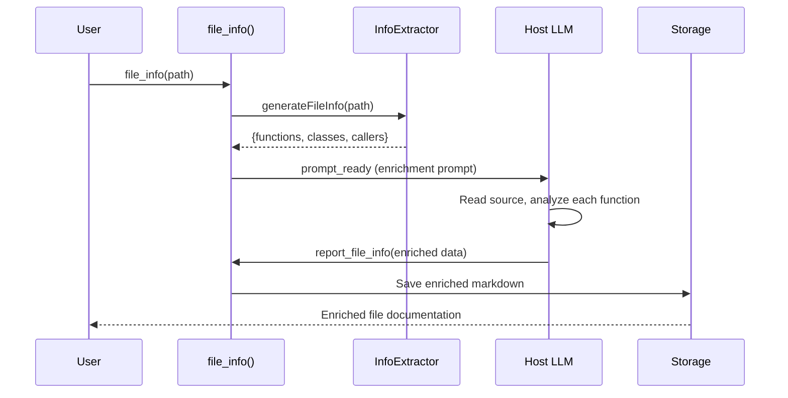

# MCP Refactor Design

## Overview

Refactor the MCP to provide a single, focused tool: `file_info()`. This tool generates semantic documentation for source files by combining structural extraction with LLM-powered summarization.

## Goals

1. **Single Entry Point**: One tool (`file_info`) instead of 5 scattered tools
2. **LLM-Powered Enrichment**: LLM reads source, summarizes each function
3. **Semantic Understanding**: Output should be detailed enough to reimplement the function
4. **Connection Awareness**: Document file's relationships (imports, callers)

## MCP Flow



## Output Format (Enriched)

```markdown
# src/graph/builder.ts

## Overview

This file handles graph construction from parsed artifacts.
It reads import/export data and builds node/edge structures.

**Inputs**: Artifact bundles from `.artifacts/` directory
**Outputs**: ImportGraph, CallGraph data structures
**Connections**: Called by `src/graph/index.ts::buildGraphs`

---

## Functions

### `buildCallGraph(artifacts: ArtifactBundle[]): CallGraph`

**Purpose**: Constructs a call graph from parsed file artifacts.

**Implementation Summary**:
1. Creates nodes for each function/method entity
2. Builds auxiliary indices for lookup
3. Resolves call edges using import bindings
4. Returns graph with resolved and unresolved calls

**Called by:**
- `buildGraphs` in `src/graph/index.ts`

---

## Classes

### `ResolutionCache`

**Purpose**: Caches resolved symbol lookups to avoid redundant computation.

#### Methods

##### `get(key: string): string | undefined`
Retrieves cached resolution result.

##### `set(key: string, value: string): void`
Stores resolution result for future lookups.
```

## New Tool Schema

### `file_info`

```typescript
FileInfoSchema = z.object({
    path: z.string().describe('Path to file (relative to workspace root)')
});
```

**Response**: `prompt_ready` with enrichment prompt

### `report_file_info` (callback)

```typescript
ReportFileInfoSchema = z.object({
    path: z.string().describe('File path'),
    overview: z.string().describe('File overview summary'),
    inputs: z.string().optional().describe('What the file takes as input'),
    outputs: z.string().optional().describe('What the file produces'),
    functions: z.array(z.object({
        name: z.string(),
        purpose: z.string(),
        implementation: z.string()
    }))
});
```

**Response**: Saves enriched markdown to `.artifacts/src/<path>/file_name.md`

## Prompt Template

```
You are a Code Documentation Assistant.

I have extracted the following structure for file: "{filePath}"

## Structural Info:
{fileInfoMarkdown}

## Source Code:
{sourceCode}

## Task:
1. Write a brief **Overview** of this file (2-3 sentences):
   - What is its purpose?
   - What are its main inputs/outputs?
   - What files depend on it or does it depend on?

2. For EACH function/method listed:
   - Write a **Purpose** (1 sentence describing what it does)
   - Write an **Implementation Summary** (3-5 bullet points, enough detail that someone could reimplement it)

3. Call `report_file_info` with your enriched documentation.
```

## Files to Change

### Remove
- `handleAnalyzeCodebase` (replaced by file_info)
- `handleReportAnalysis` (replaced by report_file_info)

### Keep (modified)
- `handleInspectSource` - Still useful for LLM to read specific lines
- `handleSetWorkspaceRoot` - Still needed for standalone mode
- `handleOpenWindow` - Keep for webview generation

### Add
- `handleFileInfo` - New primary entry point
- `handleReportFileInfo` - New callback for LLM results

## Integration with `src/info/`

The new MCP will use:
- `generateSingleFileInfo()` from `src/info/index.ts`
- `buildReverseCallIndex()` for caller info
- `readFile()` for source code

## Storage

Enriched files saved to: `.artifacts/src/<path>/file_name.md`
(Same location as basic file_info, but with LLM enrichment)