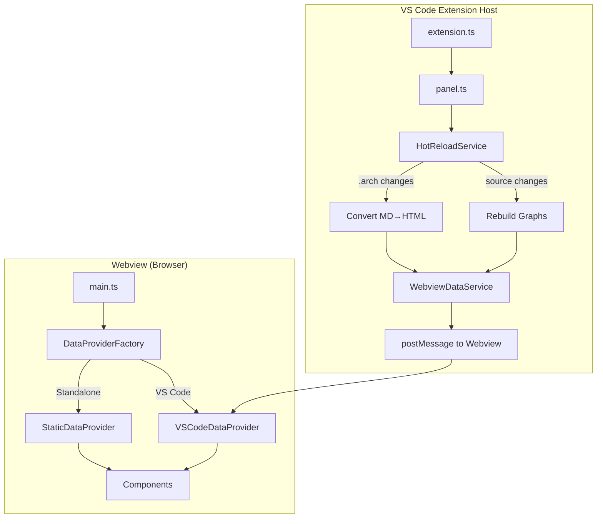

You can keep your “generate a static HTML/CSS/JS package” idea — you just stop *serving it via a local server* and instead *load that package into a VS Code webview*.

In other words, the pattern changes from:

**Old**

* generator builds `dist/`
* run `localhost:xxxx`
* browser shows UI

**New**

* generator builds `media/dist/` (inside the extension)
* extension opens a **Webview** (tab or sidebar)
* webview loads `index.html` + assets from extension files

---

## 1) Decide where it should “appear”

You have two common options:

### A. Editor tab window (easy, great default)

Use `vscode.window.createWebviewPanel(...)`.

### B. Sidebar tool window (feels like a real “plugin pane”)

Use `WebviewViewProvider` (shows under an Activity Bar icon / side panel).

If your tool is something you want always available, pick **sidebar**. If it’s more of a one-off UI, pick **panel**.

---

## 2) Stop relying on `http://localhost`

A webview can’t just fetch `http://localhost` reliably (and you don’t want that dependency anyway).

Instead you:

* ship your built UI files with the extension
* load them using **`webview.asWebviewUri()`** (VS Code’s safe resource scheme)

So your generator output should go to something like:

```
extension/
  src/extension.ts
  media/
    dist/
      index.html
      assets/...
```

---

## 3) Make the HTML “webview-safe”

This is the biggest practical change.

### A) Fix asset paths

Your `index.html` probably has links like:

```html
<script src="/app.js"></script>
<link href="/style.css" rel="stylesheet">
```

In a webview, those paths won’t work. You must rewrite them to webview URIs.

Typical pattern:

* read `index.html` as a string
* replace `src="..."` / `href="..."` with `webview.asWebviewUri(...)`

### B) Add a Content Security Policy (CSP)

Webviews are locked down. You’ll set a CSP and use a `nonce` for scripts.

### C) Don’t rely on Node APIs in the UI

Webview JS is browser JS. Any “backend” work happens in the extension host and you communicate via `postMessage`.

---

## 4) A solid implementation pattern (works with bundlers)

### `extension.ts` (panel version)

```ts
import * as vscode from "vscode";
import * as path from "path";

export function activate(context: vscode.ExtensionContext) {
  context.subscriptions.push(
    vscode.commands.registerCommand("myTool.open", () => {
      const panel = vscode.window.createWebviewPanel(
        "myTool",
        "My Tool",
        vscode.ViewColumn.One,
        {
          enableScripts: true,
          localResourceRoots: [
            vscode.Uri.joinPath(context.extensionUri, "media", "dist"),
          ],
        }
      );

      panel.webview.html = getWebviewHtml(panel.webview, context.extensionUri);
      panel.webview.onDidReceiveMessage(async (msg) => {
        // Your “generator” or MCP-like logic can run here
        if (msg.type === "generate") {
          // run generator, update artifacts, etc.
          panel.webview.postMessage({ type: "generated", ok: true });
        }
      });
    })
  );
}

function getWebviewHtml(webview: vscode.Webview, extensionUri: vscode.Uri) {
  const distRoot = vscode.Uri.joinPath(extensionUri, "media", "dist");

  // Example: if your bundler outputs assets/index.js and assets/index.css
  const scriptUri = webview.asWebviewUri(vscode.Uri.joinPath(distRoot, "assets", "index.js"));
  const styleUri  = webview.asWebviewUri(vscode.Uri.joinPath(distRoot, "assets", "index.css"));

  const nonce = String(Math.random()).slice(2);

  return /* html */ `<!doctype html>
<html>
<head>
  <meta charset="utf-8" />
  <meta
    http-equiv="Content-Security-Policy"
    content="
      default-src 'none';
      img-src ${webview.cspSource} https: data:;
      style-src ${webview.cspSource} 'unsafe-inline';
      script-src 'nonce-${nonce}';
      font-src ${webview.cspSource} https: data:;
    "
  />
  <meta name="viewport" content="width=device-width, initial-scale=1.0" />
  <link rel="stylesheet" href="${styleUri}">
</head>
<body>
  <div id="root"></div>
  <script nonce="${nonce}">
    // Make VS Code API available to your frontend
    window.vscode = acquireVsCodeApi();
  </script>
  <script nonce="${nonce}" src="${scriptUri}"></script>
</body>
</html>`;
}
```

Then inside your frontend JS:

```js
// In your web UI code
window.vscode.postMessage({ type: "generate", payload: { /* ... */ } });
window.addEventListener("message", (event) => {
  const msg = event.data;
  if (msg.type === "generated") { /* update UI */ }
});
```

---

## 5) What happens to your “generator”?

You have two clean choices:

### Option 1: Generator runs at extension build time (recommended)

* your UI build (Vite/Webpack/etc.) happens during `npm run package`
* extension ships the final `media/dist`
* webview is purely a viewer + messenger

### Option 2: Generator runs at runtime (only if you truly need it)

* extension runs the generator when user clicks “Build”
* writes output to workspace or extension storage
* webview reloads / updates via message

Most people do **Option 1** for the UI, and keep “analysis/generation of artifacts” as runtime.

---

## 6) Sidebar “window” variant (if you want it docked)

Use `WebviewViewProvider` so it lives in the left/right sidebar, like GitLens/Copilot.

High level:

* contribute a view in `package.json` under `contributes.viewsContainers` + `contributes.views`
* implement `resolveWebviewView(webviewView)` and set `webviewView.webview.html = ...`

Same HTML + URI + messaging logic as above.

---

## 7) Practical migration checklist

* [ ] Move build output to `extension/media/dist`
* [ ] Replace local server usage with `WebviewPanel` or `WebviewViewProvider`
* [ ] Ensure all assets are loaded via `webview.asWebviewUri`
* [ ] Add CSP + nonce
* [ ] Replace “call backend directly” with `postMessage` to extension
* [ ] Add commands in `package.json` to open your tool

---

If you paste (1) what your generated folder looks like (example tree) and (2) whether you want **sidebar** or **editor tab**, I can rewrite your current “serve folder” pattern into the exact extension scaffolding (including the `package.json` contributions) in the style of your repo.

---

## The core API

### Webview → Extension

In your web UI JS:

```js
const vscode = acquireVsCodeApi();
vscode.postMessage({ type: "mcp:run", tool: "get_artifacts", args: { path: "src/mcp" } });
```

### Extension → Webview

In `extension.ts`:

```ts
panel.webview.onDidReceiveMessage(async (msg) => {
  if (msg.type === "mcp:run") {
    const result = await runMcpTool(msg.tool, msg.args);
    panel.webview.postMessage({ type: "mcp:result", requestId: msg.requestId, result });
  }
});
```

In the web UI:

```js
window.addEventListener("message", (event) => {
  const msg = event.data;
  if (msg.type === "mcp:result") {
    // update the UI
  }
});
```

That’s the whole interaction model.

---

## “Text window for an MCP” inside the webview

If by “text window” you mean “a chat-like pane where the user types a prompt and sees responses”, build it in the HTML/JS and wire it to message passing.

### Example webview UI (simple chat box)

`media/dist/index.html` (or your generated HTML)

```html
<div id="chat">
  <div id="log" style="white-space:pre-wrap; border:1px solid #ccc; padding:8px; height:260px; overflow:auto;"></div>

  <textarea id="input" rows="3" style="width:100%; margin-top:8px;" placeholder="Ask MCP..."></textarea>
  <button id="send">Send</button>
</div>

<script>
  const vscode = acquireVsCodeApi();
  const log = document.getElementById("log");
  const input = document.getElementById("input");

  function append(role, text) {
    log.textContent += `${role}: ${text}\n\n`;
    log.scrollTop = log.scrollHeight;
  }

  document.getElementById("send").onclick = () => {
    const text = input.value.trim();
    if (!text) return;
    input.value = "";
    append("You", text);

    const requestId = crypto.randomUUID?.() ?? String(Date.now());
    vscode.postMessage({ type: "mcp:chat", requestId, text });
  };

  window.addEventListener("message", (event) => {
    const msg = event.data;
    if (msg.type === "mcp:chatResult") {
      append("MCP", msg.text);
    }
  });
</script>
```

### Extension side: handle chat, call your MCP tools

```ts
panel.webview.onDidReceiveMessage(async (msg) => {
  if (msg.type === "mcp:chat") {
    // 1) interpret msg.text
    // 2) choose tool(s) to run (or call your MCP server)
    // 3) return the response

    const text = msg.text as string;

    // Example: naive routing (replace with your real MCP router)
    let reply = "";
    if (text.includes("artifacts")) {
      const data = await getArtifacts({ path: "src/mcp", recursive: true });
      reply = JSON.stringify(data, null, 2);
    } else {
      reply = `Received: "${text}" (wire me to your MCP router here)`;
    }

    panel.webview.postMessage({
      type: "mcp:chatResult",
      requestId: msg.requestId,
      text: reply
    });
  }
});
```

“Hot reload” in a VS Code extension usually means two separate things:

Your extension reacts to file changes (watcher → run logic, rebuild artifacts, etc.)

Your webview UI updates (push new data, or reload UI)

You implement (1) in the extension host with watchers, and (2) by either posting messages to the webview (best) or reloading the webview (simple).
LLM: YOU FIGURE OUT WHAT IS BEST, I need to monitor changes in .arch files, and in the codebase file structure

1) Trigger a function when files change (the right watcher)
Watch files on disk (includes changes from outside VS Code)

Use vscode.workspace.createFileSystemWatcher.

import * as vscode from "vscode";

export function activate(context: vscode.ExtensionContext) {
  const watcher = vscode.workspace.createFileSystemWatcher("**/*.{ts,js,tsx,jsx,json,md}");

  const onChange = (uri: vscode.Uri) => queueRebuild(uri);

  watcher.onDidCreate(onChange, null, context.subscriptions);
  watcher.onDidChange(onChange, null, context.subscriptions);
  watcher.onDidDelete(onChange, null, context.subscriptions);

  context.subscriptions.push(watcher);
}

// Debounce to avoid firing 50 times on save/build
let timer: NodeJS.Timeout | undefined;
let pending: vscode.Uri[] = [];

function queueRebuild(uri: vscode.Uri) {
  pending.push(uri);
  if (timer) clearTimeout(timer);

  timer = setTimeout(async () => {
    const batch = pending;
    pending = [];

    await rebuildArtifacts(batch); // your MCP indexing / caching logic
    notifyWebviewArtifactsChanged(batch); // update UI
  }, 200);
}

async function rebuildArtifacts(changed: vscode.Uri[]) {
  // TODO: call your MCP pipeline: parse -> extract -> save artifacts
}

Watch “open editor buffer changes” (before save)

If you need “live typing” triggers, use:

vscode.workspace.onDidChangeTextDocument((e) => {
  // triggers on every keystroke in open docs
});


This is very noisy, so most tools trigger on save instead:

vscode.workspace.onDidSaveTextDocument((doc) => {
  queueRebuild(doc.uri);
});

2) Update the webview: message push (recommended “hot reload”)

Keep the webview running and just push new state:

let currentPanel: vscode.WebviewPanel | undefined;

function notifyWebviewArtifactsChanged(changed: vscode.Uri[]) {
  currentPanel?.webview.postMessage({
    type: "artifacts:changed",
    files: changed.map(u => u.toString())
  });
}


Webview side:

window.addEventListener("message", (event) => {
  const msg = event.data;
  if (msg.type === "artifacts:changed") {
    // re-fetch data from extension or update UI state
    // e.g. request new artifact index
    vscode.postMessage({ type: "artifacts:refresh" });
  }
});


This is the smoothest “hot reload”: no flicker, no reloading the entire UI.

3) Reload the webview entirely (simple but heavier)

If your UI is static and easiest to refresh by reloading:

function reloadWebview(panel: vscode.WebviewPanel) {
  panel.webview.html = getWebviewHtml(panel.webview, extensionUri);
}


Use this if your webview content is basically “render from scratch” and you don’t care about preserving UI

That gives you a “text window” entirely inside the webview.

---

## If you want a *real VS Code text editor* (not HTML textarea)

You have two routes:

### Route A (recommended): Keep UI in webview, but open an editor for the prompt/result

Use VS Code’s API:

* `vscode.workspace.openTextDocument({ content, language })`
* `vscode.window.showTextDocument(doc, ...)`

Example:

```ts
const doc = await vscode.workspace.openTextDocument({
  content: "Type your MCP prompt here...",
  language: "markdown"
});
await vscode.window.showTextDocument(doc, { preview: false });
```

Then you can read text from the active editor (or a specific doc) when user clicks “Run” in the webview.

### Route B: Put everything in the webview

The textarea/chat approach above.

---

## Practical “MCP UI” design that fits your plan

Since your plan has response types like:

* direct JSON
* needs_llm with `promptForHost` and callback tool

A nice webview flow is:

1. User types request
2. Extension runs MCP tool
3. Webview displays structured JSON + human summary
4. If status is `needs_llm`, webview shows a “Run host LLM” button
5. Clicking it sends the prompt back to the extension to run your host-LLM path, then posts results back and optionally saves artifact

This maps cleanly onto your `prompt_ready` / `store_summaries` concept too.

---

## One important gotcha: persistence

If you want the chat log to survive reloads:

* use `const state = vscode.getState()` / `vscode.setState()` inside webview
* or store history in `context.globalState` (extension side)

---

If you tell me which UX you want:

* **Chat inside the sidebar panel**, or
* **Chat inside an editor tab**, or
* **Webview UI + actual VS Code editor for prompt/result**,

…I can sketch the exact wiring (including `package.json` contributions and a clean message protocol like `requestId`, `type`, `payload`, `error`).


# LLMem Webview Integration
This document details the integration of the React-based Webview into the LLMem VS Code extension.

## Architecture

The integration follows a hybrid approach that supports both **Standalone Generation** (static HTML) and **Extension Panel** (dynamic, hot-reloading).

### 1. Shared Data Service (`src/webview/data-service.ts`)
Decouples data collection from the presentation layer. It aggregates:
- **Graph Data**: Import and Call graphs from `src/graph`.
- **Work Tree**: File system hierarchy from `src/webview/worktree.ts`.
- **Design Docs**: Markdown artifacts from `.arch`.

### 2. Extension Panel (`src/extension/panel.ts`)
Implements the `WebviewPanel` for VS Code.
- **Resource Loading**: Uses `webview.asWebviewUri` to securely load assets from `dist/webview` (bundled UI) and `src/webview` (styles/static).
- **Data Injection**: Dynamically injects data via `postMessage` instead of baking it into HTML.
- **Hot Reload**: Integrates with `HotReloadService` to push updates in real-time.

### 3. Hot Reload Service (`src/extension/hot-reload.ts`)
Monitors the `.artifacts` directory and workspace.
- **Watcher**: Listens for file changes, creations, and deletions.
- **Debounce**: Prevents rapid-fire updates (500ms delay).
- **Regeneration**: collecting new data via `WebviewDataService` and broadcasts `refresh` messages to the panel.

### 4. UI Bundle (`src/scripts/build_webview.ts`)
Bundles the TypeScript UI code `src/webview/ui/main.ts` into a single file `dist/webview/main.js` using `esbuild`. This ensures the webview runs in the browser environment within VS Code.

## Project Structure

```
src/
  extension/
    panel.ts          # VS Code Webview Panel implementation
    hot-reload.ts     # File watcher & data broadcaster
  webview/
    data-service.ts   # Shared data collector
    generator.ts      # Static HTML generator (Standalone)
    ui/
      main.ts         # Frontend entry point
      components/     # UI Components (GraphView, Worktree, etc.)
scripts/
  build_webview.ts    # Esbuild script for UI bundle
  generate_webview.ts # Script for standalone generation
```

## How to Run

### prerequisites
- Node.js & npm installed.
- Run `npm install` to install dependencies.

### 1. Build the Webview UI
Before running the extension or standalone view, bundle the frontend code:
```bash
npm run build:webview
```
*Note: This creates `dist/webview/main.js`.*

### 2. Run Extension (Debug Mode)
1. Open the project in VS Code.
2. Press **F5** to start debugging.
3. In the new Extension Host window, open the Command Palette (`Ctrl+Shift+P`).
4. Run: `LLMem: Open Panel`.

### 3. Trigger Hot Reload
1. With the panel open, modify any file in your workspace or the `.artifacts` directory.
2. The graph and tree in the panel will update automatically.

### 4. Run Standalone (Static Site)
Generate and view the static HTML version in your browser:
```bash
npm run view
```
This runs `src/scripts/generate_webview.ts`, which:
1. Collects data.
2. Generates `index.html` in `.artifacts/webview`.
3. Injects data directly into `graph_data.js` etc.
4. Prints the file URL to open.

### 5. Local Install
To install the extension permanently in your VS Code:
1. Package the extension:
   ```bash
   npm run package
   ```
2. Install the generated VSIX file:
   ```bash
   code --install-extension llmem-0.1.0.vsix
   # Or for Antigravity
   antigravity --install-extension llmem-0.1.0.vsix
   ```

---

# Implementation Plan (Simplified)

## Architecture Overview



**Key Simplifications:**
1. Components receive `DataProvider` directly (no service intermediaries)
2. No state persistence - state is derived from codebase on each reload
3. Hot reload has two clear paths:
   - Source files change → Rebuild graphs entirely
   - `.arch/src/*.md` changes → Re-convert affected markdown to HTML

## Files to Modify

| File | Action | Description |
|------|--------|-------------|
| `dataProvider.ts` | MODIFY | Simplified interface |
| `dataProviderFactory.ts` | NEW | Auto-detect environment |
| `staticDataProvider.ts` | MODIFY | Implement new interface |
| `vscodeDataProvider.ts` | MODIFY | Simplified message handling |
| `hot-reload.ts` | MODIFY | Separate source/arch handlers, rebuild graphs |
| `panel.ts` | MODIFY | Serve bundled UI, integrate hot reload |
| `main.ts` | MODIFY | Use factory, inject dataProvider |
| `Worktree.ts` | MODIFY | Accept dataProvider |
| `GraphView.ts` | MODIFY | Accept dataProvider |
| `DesignTextView.ts` | MODIFY | Accept dataProvider |
| `build_webview.ts` | MODIFY | Output to dist/webview/ |
| `package.json` | MODIFY | Add build scripts |