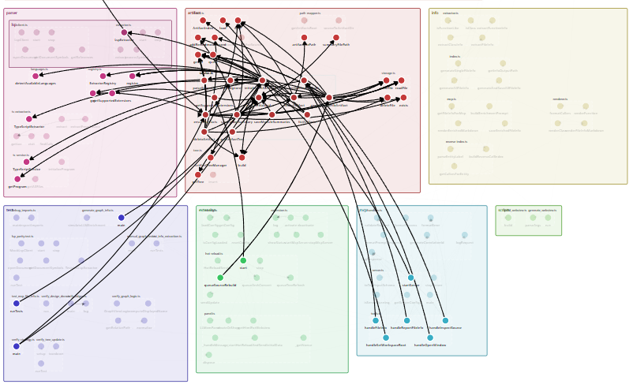

# LLMem - Codebase Graph & Documentation Tool

**LLMem** is an MCP (Model Context Protocol) server that provides **interactive graph visualization** of your codebase's import dependencies and function calls, alongside tools for generating architectural documentation.

Works with:
- **Claude Code** — as a CLI plugin with live-reloading webview
- **Antigravity IDE / VS Code** — as an extension with integrated panel

By pre-computing dependency graphs and structural summaries, LLMem allows MCP agents to provide rich codebase context **without additional reasoning or searching**. This reduces output tokens and enables broader codebase understanding in a single query.



**Note:** This project started December 11th, 2025 and is in the alpha stage. I am a team of one, developing this as a hobby. It will always stay free and open-source. If you find issues or have suggestions, please don't hesitate to contact me. You can find more information on the design of the project, and other topics on my [personal website](https://www.costasnotes.ch) and (soon) [substack](https://substack.com/@costageorgantas).

## 🚀 Key Features

- **Dual Platform**: Works as a Claude Code CLI plugin or VS Code/Antigravity extension
- **MCP-Native**: Full Model Context Protocol support for AI-powered codebase analysis
- **Graph Visualization**: Interactive visualization of import dependencies and function calls
- **Code Intelligence**: Structural analysis (imports, exports, function signatures) using Tree-sitter parsers
- **Shadow Filesystem**: Maintains a parallel `.arch/` directory with AI-generated documentation
- **Live Reload**: Graph server watches for changes and auto-updates the visualization

> [!IMPORTANT]
> **Call graphs are TypeScript/JavaScript only.** Other languages (Python, C++, Rust, R) support import graphs only.

## 🌐 Supported Languages

LLMem uses tree-sitter for fast, reliable parsing. TypeScript/JavaScript also uses the compiler API for full call graph support.

| Language | Extensions | Parser | Import Graph | Call Graph |
|----------|------------|--------|:------------:|:----------:|
| TypeScript | `.ts`, `.tsx` | TS Compiler API | ✅ | ✅ |
| JavaScript | `.js`, `.jsx` | TS Compiler API | ✅ | ✅ |
| Python | `.py` | tree-sitter | ✅ | ❌ |
| C/C++ | `.c`, `.h`, `.cpp`, `.hpp`, `.cc`, `.cxx`, `.hxx` | tree-sitter | ✅ | ❌ |
| Rust | `.rs` | tree-sitter | ✅ | ❌ |
| R | `.R`, `.r` | tree-sitter | ✅ | ❌ |

**To enable additional languages**, install the corresponding tree-sitter grammar:

```bash
npm install tree-sitter-python    # Python support
npm install tree-sitter-cpp       # C/C++ support
npm install tree-sitter-rust      # Rust support
npm install @davisvaughan/tree-sitter-r  # R support
```

> [!TIP]
> TypeScript/JavaScript works out of the box. Other languages require installing their grammar package.

## 📦 Installation

Prerequisites:
- Node.js (v18+)
- Claude Code CLI, Antigravity IDE, or VS Code

### Option A: Claude Code Plugin

1. **Clone and build**
   ```bash
   git clone https://github.com/llmem/llmem.git
   cd llmem
   npm install
   npm run build:claude
   ```

2. **(Optional) Add language support** — install grammars for languages you need:
   ```bash
   npm install tree-sitter-python tree-sitter-cpp  # etc.
   ```

3. **Add to Claude Code config** (`~/.config/claude/config.json` or `settings.json`):
   ```json
   {
     "mcpServers": {
       "llmem": {
         "command": "node",
         "args": ["/path/to/llmem/dist/claude/index.js"]
       }
     }
   }
   ```

4. **Start the graph server** (in your project directory):
   ```bash
   npm run serve
   ```
   This starts a live-reloading webview at `http://localhost:3000`.

### Option B: VS Code / Antigravity Extension

1. **Clone and build**
   ```bash
   git clone https://github.com/llmem/llmem.git
   cd llmem
   npm install
   npm run package
   ```
   This creates a `.vsix` file in the project root.

2. **(Optional) Add language support** — install grammars for languages you need:
   ```bash
   npm install tree-sitter-python tree-sitter-cpp  # etc.
   ```

3. **Install the VSIX**
   ```bash
   code --install-extension llmem-0.1.0.vsix
   # or for Antigravity:
   antigravity --install-extension llmem-0.1.0.vsix
   ```

### Development Mode

For contributors:

1. **Clone and install**
   ```bash
   git clone https://github.com/llmem/llmem.git
   cd llmem
   npm install
   ```

2. **Build**
   ```bash
   npm run build:all    # Build both VS Code extension and Claude CLI
   ```

3. **Run**
   - **VS Code/Antigravity**: Press `F5` to launch Extension Development Host
   - **Claude CLI**: Run `npm run serve` to start the graph server

## 🎯 Usage Workflow

LLMem works in two stages: **graph visualization** and **documentation generation** (via MCP tools).

### Using with Claude Code

1. **Start the graph server** in your project:
   ```bash
   npm run serve
   ```
   This opens the webview at `http://localhost:3000` with live reload.

2. **Toggle watched files** in the left panel — click the circles next to files/folders to include them in the graph.

3. **Use MCP tools** via Claude:
   - "Run mcp folder_info on src/graph"
   - "Run mcp file_info on src/mcp/tools.ts"

### Using with VS Code / Antigravity

1. **Open the LLMem Panel** via command palette (`Ctrl+Shift+P`):
   ```
   LLMem: Open View Panel
   ```

2. **Toggle watched files** — grey circles = unwatched, green = watched.

3. **Use MCP tools** via the IDE's agent.

### Navigating the Graph

The graph displays:
- **Import edges**: File-to-file import dependencies (all languages)
- **Call edges**: Function-to-function call relationships (**TypeScript/JavaScript only**)

**Controls:**
- Pan: Click and drag
- Zoom: Mouse wheel
- Select: Click a node to highlight connections

> [!TIP]
> Toggle an entire folder to watch all files within it at once.

---

## 💡 MCP Tools Reference

| Tool | Purpose |
|------|---------|
| `folder_info` | Get folder structure + prompt for LLM documentation |
| `file_info` | Get file details + prompt for LLM documentation |
| `report_folder_info` | Save LLM-generated folder docs to `.arch/{folder}/README.md` |
| `report_file_info` | Save LLM-generated file docs to `.arch/{file}.md` |
| `inspect_source` | Read specific line ranges from source files |
| `open_window` | Open the LLMem panel in the IDE |

> [!IMPORTANT]
> MCP documentation tools require the graph to be computed first. Make sure to **toggle watched files** before generating summaries.

## 🏗️ Architecture

```
User → MCP Agent (Claude Code / Antigravity) → LLMem MCP Server
```

- **User**: Asks a question about the codebase
- **Agent**: Calls MCP tools to gather context
- **LLMem**:
  1. Parses code using Tree-sitter (TS Compiler API for TypeScript/JavaScript)
  2. Builds import/call graphs from edge list data
  3. Generates documentation prompts for the LLM
  4. Saves documentation to `.arch/` directory
- **Agent**: Uses the context to answer the User

## 🛠️ Development

| Command | Description |
|---------|-------------|
| `npm run build:all` | Build everything (VS Code + Claude CLI) |
| `npm run build:vscode` | Build VS Code extension only |
| `npm run build:claude` | Build Claude CLI only |
| `npm run watch` | Watch mode for TypeScript |
| `npm run serve` | Start graph server with live reload |
| `npm test` | Run tests |

## 📁 Directory Structure

| Directory | Description |
|-----------|-------------|
| `src/extension` | VS Code/Antigravity IDE integration |
| `src/claude` | Claude Code CLI plugin and graph server |
| `src/mcp` | MCP server implementation and tool handlers |
| `src/parser` | Tree-sitter parsers for code analysis |
| `src/graph` | EdgeList data structures for imports and calls |
| `src/info` | Information extraction for documentation |
| `src/webview` | Interactive graph visualization UI |
| `src/artifact` | Shadow filesystem (`.arch/`) management |

## 📄 License

This project is licensed under the GNU General Public License v3.0 - see the [LICENSE](LICENSE) file for details.
