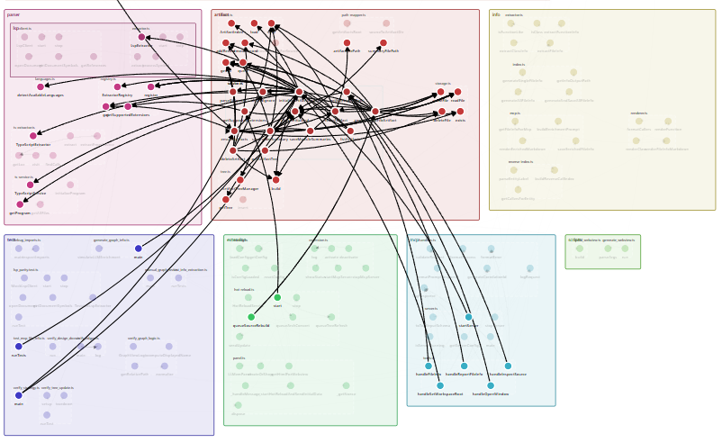

# LLMem

See your codebase as a graph of imports and function calls — then put that graph to work: an interactive viewer, a deterministic health report (cycles, hubs, clones), an AI-driven architecture review checklist, and agent-generated spec docs.

Built as an MCP server so Claude Code / Antigravity can use it as native tools — or run it standalone from the CLI.



> [!NOTE]
> Alpha. Built solo as a hobby project since December 2025 and will stay free and open-source. Bug reports, suggestions, and curious questions all welcome — open a GitHub issue or find me at [costasnotes.ch](https://www.costasnotes.ch).

## Quickstart

```bash
cd path/to/your/project
npx @cogeor/llmem
```

That's it — the first run indexes your project and opens the interactive graph viewer in your browser (port 5757, or the next free port; the URL is printed). Click circles in the left tree to add files to the graph; the view live-reloads as you edit.

Prefer a persistent install?

```bash
npm install -g @cogeor/llmem
llmem            # same zero-config viewer (serve is the default command)
```

Every command that needs the graph builds it automatically on first run — there is no separate indexing step to remember. `llmem <command> --help` shows the flags of any command.

## `llmem health` — the smell report

```bash
llmem health
```

Scans the import + call graphs and writes `.llmem/health-report.{md,json}` — deterministic (no timestamps), so two runs on the same code are byte-identical and CI can diff before/after. The scorecard from LLMem run on itself:

```
## Scorecard (measurement vector)
import cycles: 0 (runtime) / 1 (incl. type-only edges)
call cycles: 3 (mutual) / 70 (recursion)
clone clusters: 3 high (exact-body, cross-module, non-test) / 546 total
hubs: 55 unstable / 46 kernel (max fan-in 66)
interface width: max W_eff 42.46, 1 shallow-wide module(s)
files over budget: 1
```

Six dimensions: import cycles (runtime vs type-only split), call cycles + self-recursion, exact-body/shared-literal duplication, hub instability (unstable hubs are the signal; healthy kernels are listed as capped context), interface width (Ousterhout deep-module analysis), and files over the size budget.

Gate CI on any dimension:

```bash
llmem health --fail-on import-cycle   # exit 1 iff a RUNTIME import cycle exists
```

## `llmem review` — the architecture review checklist

```bash
llmem review              # whole repo
llmem review src/webview  # one subtree
```

Recalls a 65-item architecture-review checklist (34 general + 31 frontend items) against your graph: each item comes pre-loaded with the graph's candidate evidence (cycle members, hub tables, clone clusters, scanner hits) so a reviewer — human or LLM — checks *findings*, not vibes. Writes `.llmem/review/<path>.{md,json}`.

The full loop is agent-driven: via MCP, the `review` tool returns the checklist plus a prompt; the agent's LLM works through every item and `report_review` persists the completed report — with a hard completeness gate (unresolved checklist items are named, and nothing is written until all are resolved).

## `llmem install` — wire up your agent

```bash
llmem install
```

Detects the agents you have installed (Claude Code, Codex, Claude Desktop), adds llmem to each one's MCP config, and tells you to restart the agent. Target one client by name — `llmem install claude` or `llmem install codex` — and preview before touching anything:

```bash
llmem install --dry-run   # show what would be written, change nothing
llmem install --print     # print the config snippets to paste by hand
```

<details>
<summary>Configure manually</summary>

If you'd rather edit the config yourself, add an entry under `mcpServers`. The recommended form runs the globally installed binary (offline-safe — no network at launch):

```json
{
  "mcpServers": {
    "llmem": {
      "command": "llmem",
      "args": ["mcp"]
    }
  }
}
```

That assumes `npm i -g @cogeor/llmem`. If you can't install globally, fall back to `npx` (note: this re-resolves the package over the network on every launch):

```json
{
  "mcpServers": {
    "llmem": {
      "command": "npx",
      "args": ["-y", "@cogeor/llmem", "mcp"]
    }
  }
}
```

</details>

| Client | Supported | Notes |
|---|:---:|---|
| Claude Code | yes | Uses the native `claude mcp add` when the CLI is on PATH; otherwise merges a project-local `.mcp.json`. |
| Codex | yes | Merges `[mcp_servers.llmem]` into `~/.codex/config.toml`. |
| Claude Desktop | yes | Registered via the install command's `claude-desktop` target; Desktop has no launch directory, so set a workspace (see [Configuration](#configuration)). |

> [!TIP]
> `llmem serve` (the web viewer) and `llmem mcp` (the agent-facing MCP server) are independent processes. You can run both, just one, or neither — they don't depend on each other.

## Spec docs for any folder

LLMem can generate per-folder and per-file spec docs into a parallel `.llmem/docs/` tree next to your source. The flow is two MCP calls:

1. Agent calls `document { path: "src/parser" }` → LLMem detects file-vs-folder and returns the structure plus an enrichment prompt.
2. Agent runs the prompt through its LLM, then calls `report_document` with the response.
3. LLMem writes `.llmem/docs/src/parser/README.md` (folders) or `.llmem/docs/src/parser/<file>.md` (files).

Without an MCP-aware agent, the same pipeline runs from the shell:

```bash
llmem document src/parser --prompt-only      # prints the LLM prompt
llmem document src/parser --content-file -   # reads LLM JSON from stdin, writes the doc
```

### MCP tools

| Tool | What it does |
|---|---|
| `review` ↔ `report_review` | Two-call pair: checklist + graph evidence + prompt → completed review at `.llmem/review/{path}.md` (hard completeness gate) |
| `document` ↔ `report_document` | Two-call pair: file/folder structure + prompt → enriched doc at `.llmem/docs/{path}.md` (file) or `.llmem/docs/{path}/README.md` (folder) |
| `open_window` | Returns a URL to the live viewer if `serve` is running, else a static `file://` snapshot |

`document` scans the target on demand and refreshes any stale edges before generating the summary — no manual step needed. The first call on a large folder does a one-time full parse; subsequent calls are incremental (a stat-walk + diff, re-parsing only what changed). Pass `refresh: "skip"` to bypass the freshness check entirely for back-to-back same-turn calls on a target you just refreshed.

## Languages

This table is the user-facing view of the single source of truth — the `LANGUAGES` descriptor in `src/parser/languages.ts`. `npm run check:langs` asserts the rows here stay in sync with that descriptor and with the grammar peer dependencies in `package.json`.

| Language | Extensions | Grammar package | Call graph |
|---|---|---|:---:|
| TypeScript/JavaScript | `.ts`, `.tsx`, `.js`, `.jsx` | built-in (TS compiler API) | semantic |
| Python | `.py` | `tree-sitter-python` | heuristic [^pycg] |
| C/C++ | `.c`, `.h`, `.cpp`, `.hpp`, `.cc`, `.cxx`, `.hxx` | `tree-sitter-cpp` | import-only |
| Rust | `.rs` | `tree-sitter-rust` | import-only |
| R | `.r`, `.R` | `@davisvaughan/tree-sitter-r` | import-only |

TypeScript and JavaScript work out of the box (no grammar, no toolchain). For the others, install the matching tree-sitter grammar:

```bash
npm install -g tree-sitter-python tree-sitter-cpp tree-sitter-rust @davisvaughan/tree-sitter-r
```

Call graphs come in two flavours: **semantic** (TypeScript/JavaScript — resolved through the TS compiler) and **heuristic** (Python — see below). Every other language contributes import edges only.

[^pycg]: **Python call edges are heuristic** — they are name-matched (a call to `foo()` or `self.foo()` links to a same-name function/method), so they aid navigation and summaries but may miss dynamic dispatch (`getattr`, callables passed as arguments), decorators/metaclasses/properties, and same-name collisions across files. Cross-file edges resolve only when the call's base name matches an imported specifier that maps to a workspace file; bare package imports may resolve to a module node rather than the precise function. Heuristic nodes are badged in the viewer and the folder-summary prompt carries a caveat. It is great for navigation and summaries, **not a soundness tool**.

> [!NOTE]
> The grammar packages are **optional** native dependencies. npm installs a prebuilt binary for your Node ABI when one is published; otherwise it compiles the grammar with node-gyp, which needs a C/C++ toolchain (build-essential / Xcode CLT / MSVC Build Tools). If a grammar fails to build, LLMem still runs — that language is simply skipped until the toolchain is available and you reinstall.

## Configuration

All optional:

| Setting | Default | What it controls |
|---|---|---|
| `artifactRoot` | `.llmem/graph` | Where edge lists and the generated webview live (under the single `.llmem/` tree) |
| `maxFileSizeKB` | `512` | Skip files larger than this when scanning |
| `maxFileLines` | `2000` | Skip files with more than this many lines when scanning |
| `maxFilesPerFolder` | `20` | Viewer/context **display** heuristic only — caps how many files a folder summary lists for readability |

### What caps the graph scan (and what doesn't)

The graph scan caps are **file size** (`maxFileSizeKB`), **line count** (`maxFileLines`), the **folder ignore list** (`node_modules`, `.git`, etc.), and a **generated-file denylist**. The denylist drops files matching `*.min.*`, `*.bundle.*`, `*.generated.*`, and `*.d.ts` — typical build output / graph noise.

`maxFilesPerFolder` is **not** a graph scan cap. It only trims how many files a folder summary displays; it never silently truncates the graph. More generally, **any cap that excludes content is surfaced in the summary's coverage notes by name** (the exact paths dropped) — nothing is ever dropped silently.

> [!NOTE]
> `.d.ts` is on the denylist **by default** because declaration files are usually generated noise. But declaration files can be the public API of a TypeScript package — this is a documented, droppable entry. If you need them in the graph, treat the denylist as a known caveat.

`LLMEM_WORKSPACE` is **optional** for project-aware agents. Claude Code and Codex launch the MCP server from your project directory, so llmem auto-detects the workspace — you don't need to set anything. Set `LLMEM_WORKSPACE` only for Claude Desktop (which has no launch directory) or to pin the server to one specific project:

```json
{
  "mcpServers": {
    "llmem": {
      "command": "llmem",
      "args": ["mcp"],
      "env": { "LLMEM_WORKSPACE": "/absolute/path/to/your/project" }
    }
  }
}
```

VS Code reads the same settings from `.vscode/settings.json` under the `llmem.*` namespace (e.g. `llmem.artifactRoot`).

## VS Code / Antigravity extension

The extension isn't on the marketplace yet. To build the VSIX from source, see [CONTRIBUTING.md](CONTRIBUTING.md).

## Contributing

PRs welcome. See [CONTRIBUTING.md](CONTRIBUTING.md) for dev setup, repo layout, and the test suite.

## License

MIT — see [LICENSE](LICENSE).
